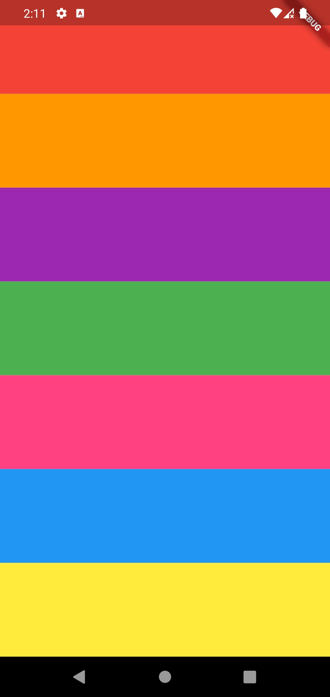

# تطبيق بيانو بسيط (أيفون و أندرويد)

## الوصف:

- تطبيق تم إنشاؤه يعمل بنظام الأندرويد والأيفون.
- عندما يقوم المستخدم بالضغط على أي لون يقوم التطبيق بإصدار نغمة.
- كل لون لديه صوت مختلف.

## صور التطبيق:

# Simple Piano App (iOS & android)

## Description:

- A Flutter project.
- It is created for iOS & android.
- When click any color it makes a sound. Each color has different sound.

## Application images:

